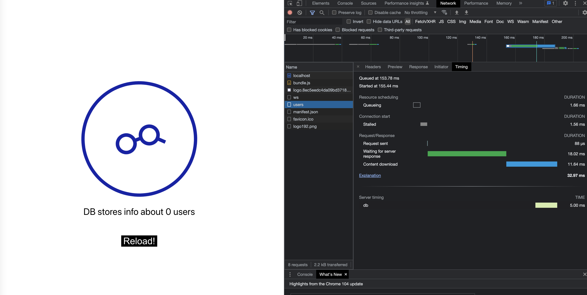

## 3 layer app

### Quick start on Golem network

#### Prerequisites

- Installed `dapp-runner` (please follow https://github.com/golemfactory/dapp-runner)
- Yagna daemon running as requestor (please follow https://handbook.golem.network/requestor-tutorials/flash-tutorial-of-requestor-development)
- YAGNA_APPKEY environment variable set to your yagna app-key
- [optional] if you want to run this app on specific subnet, on different network or with non-default yagna urls, please edit `config.yaml` accordingly

#### Run application

After meeting all prerequisites, execute following command:

```
dapp-runner start --config config.yaml app.yaml
```

After a while you should get yellow log in terminal containing following message:

```
{"db": {"0": "running"}, "frontend": {"0": "running"}, "backend": {"0": "running"}}
Dapp started.
```

In your browser, navigate to frontend local_proxy_address which usually is `localhost:8080`.
Address can be found in following terminal log:

```
{"frontend": {"local_proxy_address": "http://localhost:8080"}}
```

You should be able to see following page:


### Quick start with docker compose

If you want to run it with docker-compose, please checkout to e7f76a48149053e71d42f16b95b2dc6ec6534817 commit.
